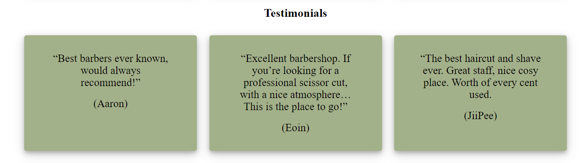
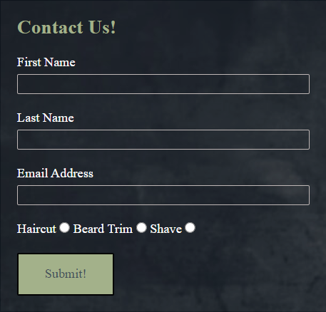

# Man Cave Barber

<h2><a href="https://luciotorelli.github.io/nature-one/index.html" target="_blank">Live Website here</a></h2>

---

## Features

---

## Navigation

- At the top of the page, navigation shows name of the barber hop
- At the middle of header is Book now button, redirecting you to contact form
- The other navigation links are: Services, Prices, About and Contact

---

## Site Owner Goals:

- Create a website for barber shop.
- The website/business purpose is easily identifiable on the first page.
- The website is responsive and adaptable for Mobile, Desktop and in-between screens.

---

## Services

- This section shows three pictures of services we do. Haircut, Beard trim and shave

--

## Prices

- Section shows prices of our services

---

## Testimonials

- Here are what customers think about us

---

## About

- Section about us

---

## Contact

- Contact form collect details about customer name, email address and what service want to book

