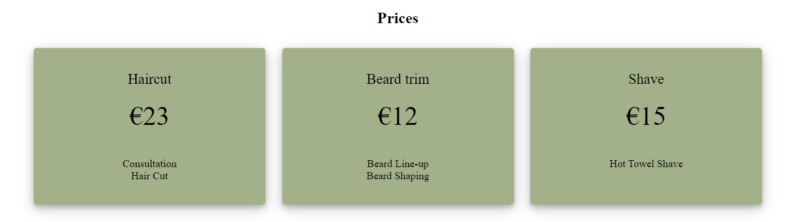
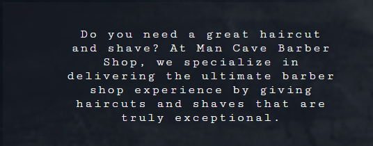
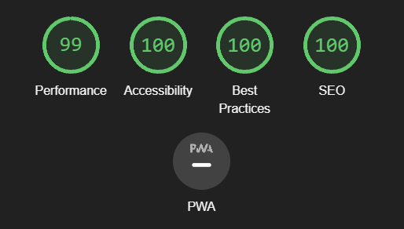

# Man Cave Barber

<h2><a href="https://sebmigas.github.io/The-Man-Cave-Barber/" target="_blank">Live Website here</a></h2>

---

## Features

---

## Navigation

- At the top of the page, navigation shows name of the barber hop
- The other navigation links are: Services, Prices, and Book Now

---

## Site Owner Goals:

- Create a website for barber shop.
- The website/business purpose is easily identifiable on the first page.
- The website is responsive and adaptable for Mobile, Desktop and in-between screens.

---

## Services

- This section shows three pictures of services we do. Haircut, Beard trim and shave

--

## Prices

- Section shows prices of our services

---

## Testimonials

- Here are what customers think about us

---

## About

- Section about us

---

## Contact

- Contact form collect details about customer name, email address and what service want to book

---

## Content

- the code to make header and social media taken and adjusted from Love Running project
- The code for the hamburger menu was sourced from https://alvarotrigo.com/blog/hamburger-menu-css/
- The code for back to top button was sourced from https://www.w3schools.com/
---

## Technologies used

- [HTML 5](https://en.wikipedia.org/wiki/HTML5) - The HyperText Markup Language or HTML is the standard markup language for documents designed to be displayed in a web browser.
- [CSS3](https://www.w3schools.com/css/) - Cascading Style Sheets (CSS) is a style sheet language used for describing the presentation of a document written in a markup language such as HTML.
- [Font Awesome](https://fontawesome.com/) - Font Awesome is a font and icon toolkit based on CSS and Less.
- [Github and Git](https://docs.github.com/en/get-started/using-git/about-git) - GitHub, Inc., is an Internet hosting service for software development and version control using Git.

---

## Validator Testing

- The code for all pages was tested against <a href="https://validator.w3.org/">W3C Markup validation service.</a>
- The code for the CSS file was tested against <a href="https://jigsaw.w3.org/css-validator/">W3C CSS validation service.</a>
- All files were tested during development using the <a href="https://github.com/streetsidesoftware/vscode-spell-checker">Spelling checker for Visual Studio Code extension.</a>

---

## Testing

- I tested that tis page works with different browsers: Chrome, Brave, Safari, Firefox
- I have tested book now form: requires entries in every field, will only accept an email in email field
- I confirmed that this project is responsive and looks good on all standard screens
- The footer section provide user with links to the social media of the website and address.
- I tested that navigation area is readable and easy to understand

---

## Deployment

The project was deployed using [Github pages](https://pages.github.com/) and updated using the [Live Server VScode extension](https://marketplace.visualstudio.com/items?itemName=ritwickdey.LiveServer) following those steps; 

1. Development of project and testing using VScode and Live Server on Chrome, Firefox, Opera and Edge.
2. Once development was completed the page was deployed by heading first to Settings on Github.
3. Clicking on Pages on the left sidebar.
4. Selecting the main branch.
5. Clicking save.

---

## Credits

* Caleb my mentor. I am grateful for the guidance and all help
* [@WebDevSimplified](https://github.com/WebDevSimplified) and [@kevin-powell](https://github.com/kevin-powell) for inspiration and tutorials

### Resources used

  * [Code Institute Full Stack - Course material, mentoring and tutoring](https://codeinstitute.net/ie/full-stack-software-development-diploma/)
  * [Stackoverflow - Having the answers to many of my questions](https://stackoverflow.com/)
  * [W3Schools - Used to check how to use certain CSS properties and HTML elements](https://www.w3schools.com/)
  * [Balsamiq - Used to draw the wireframes of the project](https://balsamiq.com/)
  * [W3C markup validation service](https://validator.w3.org/)
  * [Jigsaw CSS validation service](https://jigsaw.w3.org/css-validator/)
  * [Pexels - Used to get all images and videos used in the project](https://www.pexels.com/)
  * [Chrome Devtools - Used to debug the code, test responsiveness and run lighthouse reports](https://developer.chrome.com/docs/devtools/)
  * [Coolors - Used to create the color palette for the project](https://coolors.co/)
  * [Pixlr - Used to resize and edit contrast of images used on the project](https://pixlr.com/e/)
  * [VScode - Used to write the code for this project](https://code.visualstudio.com/)
  * [Gitpod - Used in the initial part of the project until a local desktop environment was setup.](https://gitpod.io/workspaces)
  * [Am I responsive? - Used to create main image used on README](https://ui.dev/amiresponsive)
  * [Google Fonts - Used to import Google font to the project](https://fonts.google.com/specimen/Open+Sans?query=open)
 

